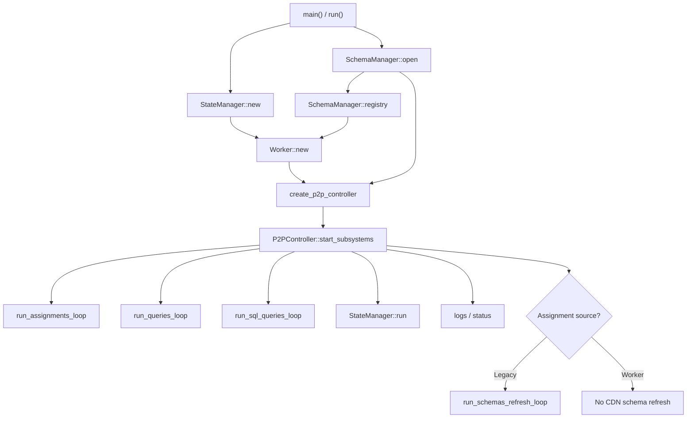
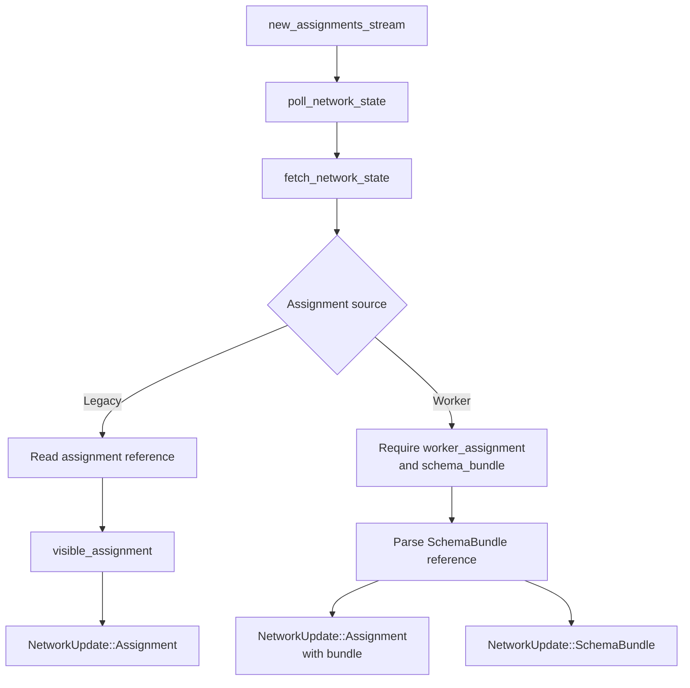
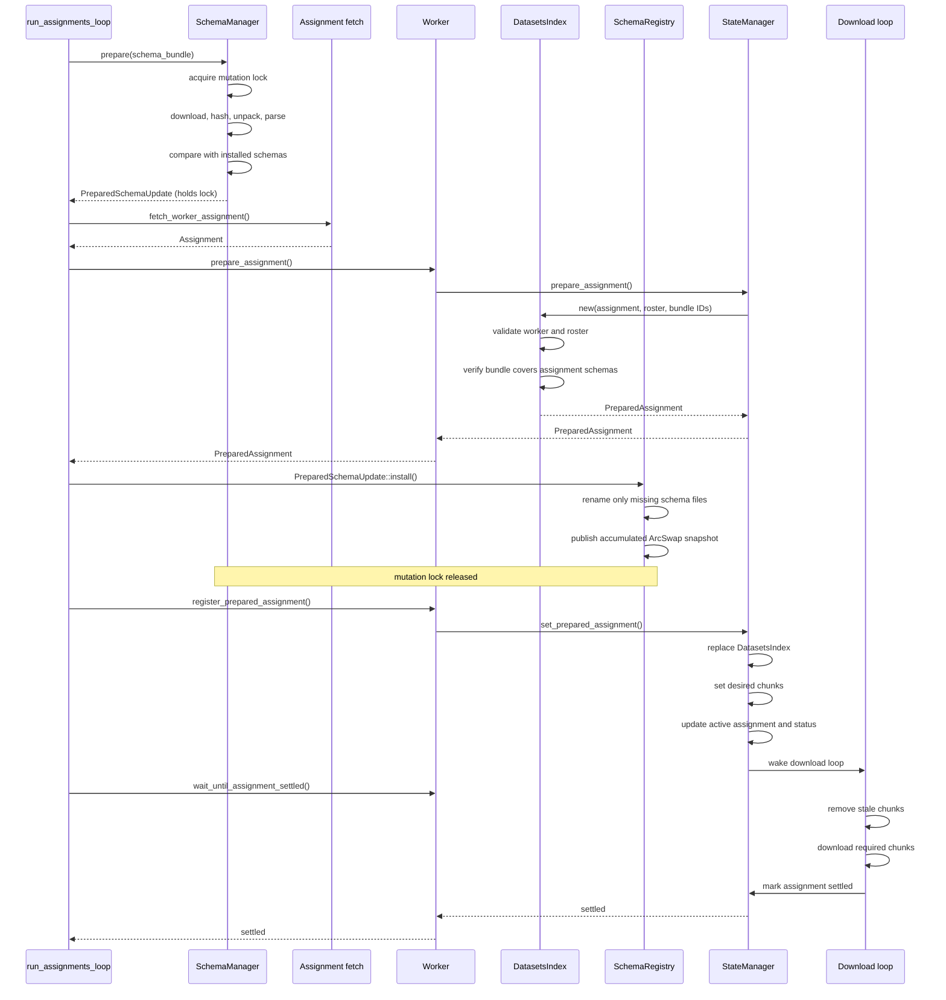
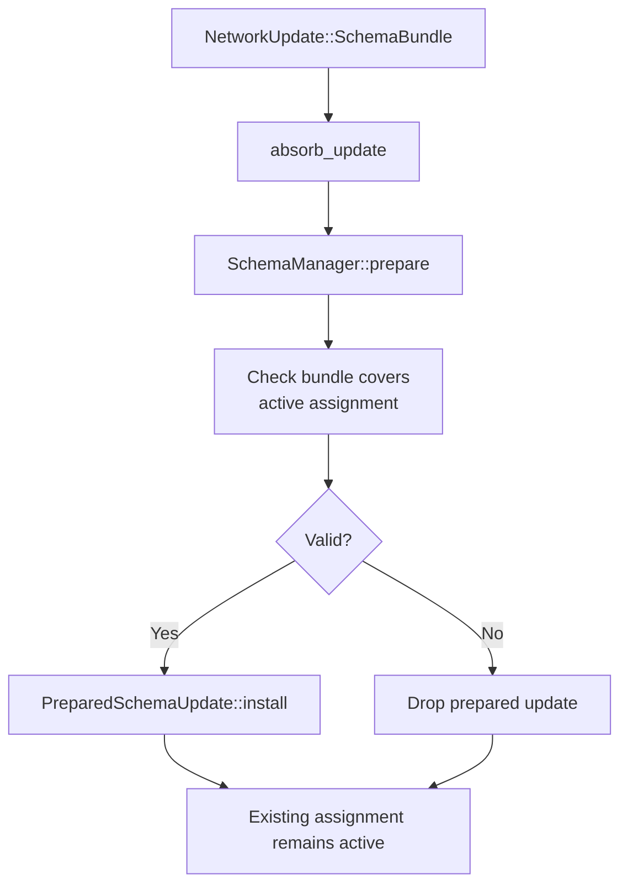
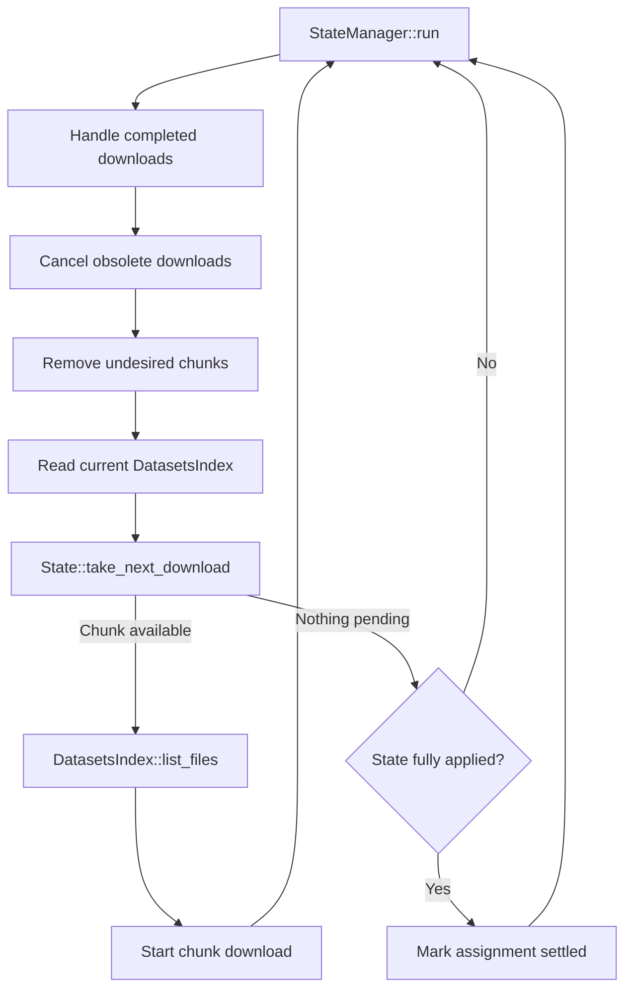
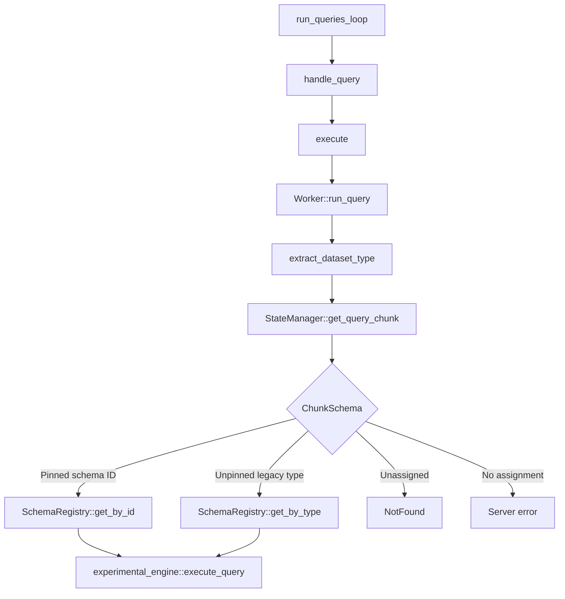

# PR 4 call graph

Temporary review aid for the worker-assignment and schema-bundle flow.

## Startup and subsystem wiring

`SchemaManager` owns and serializes schema mutation. `SchemaRegistry` is the
lock-free query view. `StateManager` owns assignment and chunk state. `Worker`
connects queries to both registries.

## Network-state discovery

Worker-mode network state is not an application snapshot. The assignment and
bundle form a validation boundary, while installed schemas accumulate by
immutable schema ID.

## Worker-assignment application

A rejection before registration preserves the current active assignment and
status. `SchemaManager::prepare()` precedes assignment fetching, so its guard is
held during assignment download and validation as well as filesystem mutation.

## Bundle-only update

This installs newly available immutable schemas without re-registering the
current assignment.

## Storage reconciliation

Worker assignments derive required `<table>.parquet` files from the schema
roster and chunk bitmap. Legacy assignments carry explicit file lists.

## Query-time schema selection

Worker-format chunks return a pinned schema ID resolved from the accumulated
registry snapshot. Old schema IDs must remain available while existing chunks
can still reference them.

## Legacy and worker differences

| Concern | Legacy | Worker assignment |
| --- | --- | --- |
| Schema source | Periodic CDN refresh | `schema_bundle` in network state |
| Assignment content | Explicit files | Schema roster and chunk bitmap |
| Schema lookup | Dataset type | Immutable schema ID |
| Schema update | Replace legacy view | Add missing schemas |
| Bundle validation | Separate refresh | Covers every assignment schema ID |
| Application | Apply assignment directly | Prepare bundle, validate assignment, install schemas, publish assignment |
